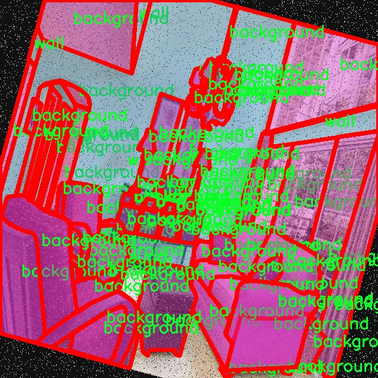

### 1.背景意义

研究背景与意义

随着智能家居和自动化技术的快速发展，室内场景理解已成为计算机视觉领域的重要研究方向。室内场景分割不仅对智能家居系统的环境感知至关重要，还在机器人导航、增强现实和虚拟现实等应用中扮演着关键角色。传统的室内场景分析方法往往依赖于手工特征提取，效率低下且适应性差，而深度学习技术的引入为这一领域带来了革命性的变化。

YOLO（You Only Look Once）系列模型因其高效的实时检测能力而受到广泛关注。YOLOv11作为该系列的最新版本，结合了更深层次的网络结构和更先进的特征提取技术，能够在复杂的室内环境中实现高精度的物体检测与分割。然而，现有的YOLOv11模型在处理特定室内场景（如墙壁和地板）时，仍存在一定的局限性，尤其是在细粒度分割和背景处理方面。因此，改进YOLOv11以增强其在室内场景分割中的表现，具有重要的理论和实践意义。

本研究基于一个包含9200张图像的“墙壁与地板”数据集，数据集中标注了三类对象：背景、地板和墙壁。这些类别的细分为模型的训练提供了丰富的样本，使得模型能够更好地学习不同室内元素的特征。此外，数据集经过多种预处理和增强技术的处理，提升了模型的鲁棒性和泛化能力。通过对YOLOv11的改进，我们期望能够实现更高效的室内场景分割，推动智能家居和相关领域的进一步发展。

综上所述，基于改进YOLOv11的室内场景分割系统的研究，不仅能够提升室内环境理解的准确性，还将为智能家居、机器人导航等应用提供更为可靠的技术支持，为相关领域的研究与应用开辟新的方向。

### 2.视频效果

[2.1 视频效果](https://www.bilibili.com/video/BV15PCcYGELh/)

### 3.图片效果


##### [项目涉及的源码数据来源链接](https://kdocs.cn/l/cszuIiCKVNis)**

注意：本项目提供训练的数据集和训练教程,由于版本持续更新,暂不提供权重文件（best.pt）,请按照6.训练教程进行训练后实现上图演示的效果。

### 4.数据集信息

##### 4.1 本项目数据集类别数＆类别名

nc: 3
names: ['background', 'floor', 'wall']


该项目为【图像分割】数据集，请在【训练教程和Web端加载模型教程（第三步）】这一步的时候按照【图像分割】部分的教程来训练

##### 4.2 本项目数据集信息介绍

本项目数据集信息介绍

本项目旨在改进YOLOv11的室内场景分割系统，所使用的数据集专注于“墙面与地面”的主题，旨在为室内环境的理解和分析提供高质量的标注数据。该数据集包含三类主要对象，分别是背景、地面和墙面。这三类对象的选择不仅反映了室内场景的基本构成元素，也为深度学习模型的训练提供了丰富的上下文信息。

在数据集的构建过程中，我们收集了多样化的室内场景图像，确保涵盖不同的房间类型、布局和装饰风格。这些图像来源于真实的居住环境、办公空间以及公共场所，力求在视觉上呈现出丰富的多样性。每张图像都经过精确的标注，确保墙面和地面的边界清晰可辨，背景部分则被标记为无关区域，以便模型能够有效地区分主要对象与环境的其他部分。

数据集的类别数量为三，具体包括“背景”、“地面”和“墙面”。在训练过程中，模型将学习如何识别和分割这些类别，从而实现对室内场景的精确理解。背景类别的引入有助于模型在复杂环境中保持稳定性，避免误判，而地面和墙面的标注则为模型提供了明确的目标，使其能够在实际应用中更好地执行场景分割任务。

通过对该数据集的深入分析与训练，我们期望改进YOLOv11在室内场景分割中的表现，提升其在实际应用中的准确性和鲁棒性。最终目标是为智能家居、室内导航以及虚拟现实等领域提供更为精确的技术支持，推动相关技术的进一步发展与应用。




### 5.全套项目环境部署视频教程（零基础手把手教学）

[5.1 所需软件PyCharm和Anaconda安装教程（第一步）](https://www.bilibili.com/video/BV1BoC1YCEKi/?spm_id_from=333.999.0.0&vd_source=bc9aec86d164b67a7004b996143742dc)


[5.2 安装Python虚拟环境创建和依赖库安装视频教程（第二步）](https://www.bilibili.com/video/BV1ZoC1YCEBw?spm_id_from=333.788.videopod.sections&vd_source=bc9aec86d164b67a7004b996143742dc)

### 6.改进YOLOv11训练教程和Web_UI前端加载模型教程（零基础手把手教学）

[6.1 改进YOLOv11训练教程和Web_UI前端加载模型教程（第三步）](https://www.bilibili.com/video/BV1BoC1YCEhR?spm_id_from=333.788.videopod.sections&vd_source=bc9aec86d164b67a7004b996143742dc)


按照上面的训练视频教程链接加载项目提供的数据集，运行train.py即可开始训练



     Epoch   gpu_mem       box       obj       cls    labels  img_size
     1/200     20.8G   0.01576   0.01955  0.007536        22      1280: 100%|██████████| 849/849 [14:42<00:00,  1.04s/it]
               Class     Images     Labels          P          R     mAP@.5 mAP@.5:.95: 100%|██████████| 213/213 [01:14<00:00,  2.87it/s]
                 all       3395      17314      0.994      0.957      0.0957      0.0843

     Epoch   gpu_mem       box       obj       cls    labels  img_size
     2/200     20.8G   0.01578   0.01923  0.007006        22      1280: 100%|██████████| 849/849 [14:44<00:00,  1.04s/it]
               Class     Images     Labels          P          R     mAP@.5 mAP@.5:.95: 100%|██████████| 213/213 [01:12<00:00,  2.95it/s]
                 all       3395      17314      0.996      0.956      0.0957      0.0845

     Epoch   gpu_mem       box       obj       cls    labels  img_size
     3/200     20.8G   0.01561    0.0191  0.006895        27      1280: 100%|██████████| 849/849 [10:56<00:00,  1.29it/s]
               Class     Images     Labels          P          R     mAP@.5 mAP@.5:.95: 100%|███████   | 187/213 [00:52<00:00,  4.04it/s]
                 all       3395      17314      0.996      0.957      0.0957      0.0845


###### [项目数据集下载链接](https://kdocs.cn/l/cszuIiCKVNis)

### 7.原始YOLOv11算法讲解


其实到了YOLOV11 基本创新点就不太多了，主要就是大家互相排列组合复用不同的网络模块、损失函数和样本匹配策略，需要注意YOLO V5、V8 V11
都是1个公司的，其余的个人建议看看V8的，剩下的了解就好。

V11支持多种视觉任务：物体检测、实例分割、图像分类、姿态估计和定向物体检测（OBB）。

##### YOLOv11
基本和YOLOV8同源，甚至git目前都是1个，部分代码注释还是YOLOV8的，所以建议先看我写的YOLOV8相关博客，对比YOLOV8主要涉及到：

*backbone 中的使用C2f模块 变为 c3k2 模块。

*backbone 中的最后一层（sppf层）后增加了C2PSA模块。

*head 解耦头中的分类检测头两个Conv 变为 DWConv。

整体技术而言：

*backbone 使用了C2K2模块+最后SPPF模块级联C2PSA模块；

*neck 使用PAN结构，并且里面也使用C3K2模块；

*head使用了anchor-free + Decoupled-head，其中回归头使用正常的卷积，分类头使用DWConv；

*损失函数使用了分类BCE、回归CIOU + VFL的组合；

*框匹配策略由静态匹配改为了Task-Aligned Assigner匹配方式；

*训练策略没有提及，其中YOLOV8可以参考如下最后 10 个 epoch 关闭 Mosaic 的操作、训练总 epoch 数从 300 提升到了 500。

##### 主要思路


配置文件：[ultralytics/ultralytics/cfg/models/11/yolo11.yaml at main ·
ultralytics/ultralytics ·
GitHub](https://github.com/ultralytics/ultralytics/blob/main/ultralytics/cfg/models/11/yolo11.yaml
"ultralytics/ultralytics/cfg/models/11/yolo11.yaml at main ·
ultralytics/ultralytics · GitHub")

解析函数：[ultralytics/ultralytics/nn/tasks.py at main · ultralytics/ultralytics ·
GitHub](https://github.com/ultralytics/ultralytics/blob/main/ultralytics/nn/tasks.py#L934
"ultralytics/ultralytics/nn/tasks.py at main · ultralytics/ultralytics ·
GitHub")


##### 具体细节

##### input

输入要求以及预处理，可选项比较多，可以参考这个配置文件：[ultralytics/ultralytics/cfg/default.yaml at main
· ultralytics/ultralytics ·
GitHub](https://github.com/ultralytics/ultralytics/blob/main/ultralytics/cfg/default.yaml
"ultralytics/ultralytics/cfg/default.yaml at main · ultralytics/ultralytics ·
GitHub") 的Hyperparameters 部分。

基础输入仍然为640*640。预处理就是熟悉的letterbox（根据参数配置可以为不同的缩放填充模式，主要用于resize到640）+
转换rgb、chw、int8(0-255)->float（0-1），注意没有归一化操作。需要注意的是作者实现的mosaic和网上看到的不同，对比如下图（左边网上版本，右边是YOLO的实现）。并且作者添加了在最后10轮关闭mosaic增强（YOLOV8开始支持，具体原因个人的经验如我的这篇文章：yolov5
mosaic相关，关闭参数在 Train settings 部分的close_mosaic 选项）


##### backbone

主干网络以及改进

这里不去特意强调对比YOLOv5、V8等等的改进，因为各个系列都在疯狂演进，个人认为没必要花费时间看差异，着重看看一些比较重要的模块即可。源代码：

大多数模块：[ultralytics/ultralytics/nn/modules/block.py at main ·
ultralytics/ultralytics ·
GitHub](https://github.com/ultralytics/ultralytics/blob/main/ultralytics/nn/modules/block.py
"ultralytics/ultralytics/nn/modules/block.py at main · ultralytics/ultralytics
· GitHub")

head 部分：[ultralytics/ultralytics/nn/modules/head.py at main ·
ultralytics/ultralytics ·
GitHub](https://github.com/ultralytics/ultralytics/blob/main/ultralytics/nn/modules/head.py
"ultralytics/ultralytics/nn/modules/head.py at main · ultralytics/ultralytics
· GitHub")

串联模块构造网络：[ultralytics/ultralytics/nn/tasks.py at main ·
ultralytics/ultralytics ·
GitHub](https://github.com/ultralytics/ultralytics/blob/main/ultralytics/nn/tasks.py
"ultralytics/ultralytics/nn/tasks.py at main · ultralytics/ultralytics ·
GitHub")

##### 1）CBS 模块（后面叫做Conv）

就是pytorch 自带的conv + BN +SiLU，这里对应上面的配置文件的Conv 的 args 比如[64, 3, 2] 就是 conv2d
的c2=64、k=3、 s =2、c1 自动为上一层参数、p 为自动计算，真实需要计算scales 里面的with 和 max_channels 缩放系数。

这里连续使用两个3*3卷积stride为2的CBS模块直接横竖各降低了4倍分辨率（整体变为原来1/16）。这个还是比较猛的，敢在如此小的感受野下连续两次仅仅用一层卷积就下采样,当然作为代价它的特征图还是比较厚的分别为16、32。


    
    
        class Conv(nn.Module):
        """Standard convolution with args(ch_in, ch_out, kernel, stride, padding, groups, dilation, activation)."""
    
        default_act = nn.SiLU()  # default activation
    
        def __init__(self, c1, c2, k=1, s=1, p=None, g=1, d=1, act=True):
            """Initialize Conv layer with given arguments including activation."""
            super().__init__()
            self.conv = nn.Conv2d(c1, c2, k, s, autopad(k, p, d), groups=g, dilation=d, bias=False)
            self.bn = nn.BatchNorm2d(c2)
            self.act = self.default_act if act is True else act if isinstance(act, nn.Module) else nn.Identity()
    
        def forward(self, x):
            """Apply convolution, batch normalization and activation to input tensor."""
            return self.act(self.bn(self.conv(x)))
    
        def forward_fuse(self, x):
            """Perform transposed convolution of 2D data."""
            return self.act(self.conv(x))

##### 2）c3k2 模块

##### Bottleneck

有两种结构，需要参数shortcut和两个conv的宽度是否相同来控制。

##### C3 & C3K

都是CSP bottleneck module with 3 convolutions, C3 代表3个卷积层，
K代表其中bottleneck中的卷积核为支持自定义，其实这里c3k作者使用的默认的3*3卷积核也就等同于使用c3(c3是3*3卷积核)。

##### c2f & c3k2

其实也就是仿照YOLOv7 的ELAN
结构，通过更多的分支夸层链接，丰富了模型的梯度流。C3K2模块其实就是C2F模块转变出来的，它代码中有一个设置，就是当c3k这个参数为FALSE的时候，C3K2模块就是C2F模块，也就是说它的Bottleneck是普通的Bottleneck；反之当它为true的时候，将Bottleneck模块替换成C3K模块。模块中存在
Split 等操作对特定硬件部署没有之前那么友好了。需要针对自己的硬件进行测试看对最终推理速度的影响。

可视化关系如下，这里需要注意配置文件中的参数，比如21行[-1, 2, C3k2, [512, False, 0.25]]
512代表宽度、false代表是否使用shortcut、0.25代表c2f的宽度缩放。也就是第一个Conv的输出宽度。


源代码如下:

    
    
    class Bottleneck(nn.Module):
        """Standard bottleneck."""
    
        def __init__(self, c1, c2, shortcut=True, g=1, k=(3, 3), e=0.5):
            """Initializes a standard bottleneck module with optional shortcut connection and configurable parameters."""
            super().__init__()
            c_ = int(c2 * e)  # hidden channels
            self.cv1 = Conv(c1, c_, k[0], 1)
            self.cv2 = Conv(c_, c2, k[1], 1, g=g)
            self.add = shortcut and c1 == c2
    
        def forward(self, x):
            """Applies the YOLO FPN to input data."""
            return x + self.cv2(self.cv1(x)) if self.add else self.cv2(self.cv1(x))
    
    class C3(nn.Module):
        """CSP Bottleneck with 3 convolutions."""
    
        def __init__(self, c1, c2, n=1, shortcut=True, g=1, e=0.5):
            """Initialize the CSP Bottleneck with given channels, number, shortcut, groups, and expansion values."""
            super().__init__()
            c_ = int(c2 * e)  # hidden channels
            self.cv1 = Conv(c1, c_, 1, 1)
            self.cv2 = Conv(c1, c_, 1, 1)
            self.cv3 = Conv(2 * c_, c2, 1)  # optional act=FReLU(c2)
            self.m = nn.Sequential(*(Bottleneck(c_, c_, shortcut, g, k=((1, 1), (3, 3)), e=1.0) for _ in range(n)))
    
        def forward(self, x):
            """Forward pass through the CSP bottleneck with 2 convolutions."""
            return self.cv3(torch.cat((self.m(self.cv1(x)), self.cv2(x)), 1))
    
    class C3k(C3):
        """C3k is a CSP bottleneck module with customizable kernel sizes for feature extraction in neural networks."""
    
        def __init__(self, c1, c2, n=1, shortcut=True, g=1, e=0.5, k=3):
            """Initializes the C3k module with specified channels, number of layers, and configurations."""
            super().__init__(c1, c2, n, shortcut, g, e)
            c_ = int(c2 * e)  # hidden channels
            # self.m = nn.Sequential(*(RepBottleneck(c_, c_, shortcut, g, k=(k, k), e=1.0) for _ in range(n)))
            self.m = nn.Sequential(*(Bottleneck(c_, c_, shortcut, g, k=(k, k), e=1.0) for _ in range(n)))
    
    class C2f(nn.Module):
        """Faster Implementation of CSP Bottleneck with 2 convolutions."""
    
        def __init__(self, c1, c2, n=1, shortcut=False, g=1, e=0.5):
            """Initializes a CSP bottleneck with 2 convolutions and n Bottleneck blocks for faster processing."""
            super().__init__()
            self.c = int(c2 * e)  # hidden channels
            self.cv1 = Conv(c1, 2 * self.c, 1, 1)
            self.cv2 = Conv((2 + n) * self.c, c2, 1)  # optional act=FReLU(c2)
            self.m = nn.ModuleList(Bottleneck(self.c, self.c, shortcut, g, k=((3, 3), (3, 3)), e=1.0) for _ in range(n))
    
        def forward(self, x):
            """Forward pass through C2f layer."""
            y = list(self.cv1(x).chunk(2, 1))
            y.extend(m(y[-1]) for m in self.m)
            return self.cv2(torch.cat(y, 1))
    
        def forward_split(self, x):
            """Forward pass using split() instead of chunk()."""
            y = list(self.cv1(x).split((self.c, self.c), 1))
            y.extend(m(y[-1]) for m in self.m)
            return self.cv2(torch.cat(y, 1))
    
    class C3k2(C2f):
        """Faster Implementation of CSP Bottleneck with 2 convolutions."""
    
        def __init__(self, c1, c2, n=1, c3k=False, e=0.5, g=1, shortcut=True):
            """Initializes the C3k2 module, a faster CSP Bottleneck with 2 convolutions and optional C3k blocks."""
            super().__init__(c1, c2, n, shortcut, g, e)
            self.m = nn.ModuleList(
                C3k(self.c, self.c, 2, shortcut, g) if c3k else Bottleneck(self.c, self.c, shortcut, g) for _ in range(n)
            )

##### 3）sppf 模块

对比spp，将简单的并行max pooling 改为串行+并行的方式。对比如下（左边是SPP，右边是SPPF）：


    
    
        class SPPF(nn.Module):
        # Spatial Pyramid Pooling - Fast (SPPF) layer for YOLOv5 by Glenn Jocher
        def __init__(self, c1, c2, k=5):  # equivalent to SPP(k=(5, 9, 13))
            super().__init__()
            c_ = c1 // 2  # hidden channels
            self.cv1 = Conv(c1, c_, 1, 1)
            self.cv2 = Conv(c_ * 4, c2, 1, 1)
            self.m = nn.MaxPool2d(kernel_size=k, stride=1, padding=k // 2)
    
        def forward(self, x):
            x = self.cv1(x)
            with warnings.catch_warnings():
                warnings.simplefilter('ignore')  # suppress torch 1.9.0 max_pool2d() warning
                y1 = self.m(x)
                y2 = self.m(y1)
                return self.cv2(torch.cat((x, y1, y2, self.m(y2)), 1))

##### 4）C2PSA 模块

C2PSA它结合了PSA(Pointwise Spatial
Attention)块，用于增强特征提取和注意力机制。下面的图建议从左到右看，这样才能更有条理的理解，其实PSA个人感觉就是仿着VIT
的Attention来做的，是把输入C2PSA的特征图的h*w 看做VIT 的path数（也可以理解为NLP中token 个数），特征图的channel
数看做VIT特征维度（CNN的宽度，或者理解为NLP中token
编码后的特征维度），然后计算出QKV（这里需要注意第四幅图的QKV是值，不是操作，所以标注成了圆角矩形，这里是为了大家好理解），这里的Attention其实是在h*w维度计算空间Attention，个人感觉是强制给了全局感受野，并且并联了一个3*3的深度可分离卷积的单空间部分，就是仅在每一个特征图上进行3*3卷积，具体实现是通过pytorch
conv2d 的
group参数设置为特征图的通道数。特别的关于Conv的参数分别为：输入通道数、输出通道数、卷积核尺寸、pad尺寸、group数、是否有激活函数（默认silu）。图中的最后一幅省略了一些细节，可以参考源码。

注意区别C2fPSA，C2fPSA才是对 C2f 模块的扩展，通过在标准 C2f 模块中引入 PSA
块，C2fPSA实现了更强大的注意力机制，从而提高了模型对重要特征的捕捉能力。作者实现了该模块但最终没有使用。


涉及的源码：

    
    
    class Attention(nn.Module):
        """
        Attention module that performs self-attention on the input tensor.
    
        Args:
            dim (int): The input tensor dimension.
            num_heads (int): The number of attention heads.
            attn_ratio (float): The ratio of the attention key dimension to the head dimension.
    
        Attributes:
            num_heads (int): The number of attention heads.
            head_dim (int): The dimension of each attention head.
            key_dim (int): The dimension of the attention key.
            scale (float): The scaling factor for the attention scores.
            qkv (Conv): Convolutional layer for computing the query, key, and value.
            proj (Conv): Convolutional layer for projecting the attended values.
            pe (Conv): Convolutional layer for positional encoding.
        """
    
        def __init__(self, dim, num_heads=8, attn_ratio=0.5):
            """Initializes multi-head attention module with query, key, and value convolutions and positional encoding."""
            super().__init__()
            self.num_heads = num_heads
            self.head_dim = dim // num_heads
            self.key_dim = int(self.head_dim * attn_ratio)
            self.scale = self.key_dim**-0.5
            nh_kd = self.key_dim * num_heads
            h = dim + nh_kd * 2
            self.qkv = Conv(dim, h, 1, act=False)
            self.proj = Conv(dim, dim, 1, act=False)
            self.pe = Conv(dim, dim, 3, 1, g=dim, act=False)
    
        def forward(self, x):
            """
            Forward pass of the Attention module.
    
            Args:
                x (torch.Tensor): The input tensor.
    
            Returns:
                (torch.Tensor): The output tensor after self-attention.
            """
            B, C, H, W = x.shape
            N = H * W
            qkv = self.qkv(x)
            q, k, v = qkv.view(B, self.num_heads, self.key_dim * 2 + self.head_dim, N).split(
                [self.key_dim, self.key_dim, self.head_dim], dim=2
            )
    
            attn = (q.transpose(-2, -1) @ k) * self.scale
            attn = attn.softmax(dim=-1)
            x = (v @ attn.transpose(-2, -1)).view(B, C, H, W) + self.pe(v.reshape(B, C, H, W))
            x = self.proj(x)
            return x
    
    class PSABlock(nn.Module):
        """
        PSABlock class implementing a Position-Sensitive Attention block for neural networks.
    
        This class encapsulates the functionality for applying multi-head attention and feed-forward neural network layers
        with optional shortcut connections.
    
        Attributes:
            attn (Attention): Multi-head attention module.
            ffn (nn.Sequential): Feed-forward neural network module.
            add (bool): Flag indicating whether to add shortcut connections.
    
        Methods:
            forward: Performs a forward pass through the PSABlock, applying attention and feed-forward layers.
    
        Examples:
            Create a PSABlock and perform a forward pass
            >>> psablock = PSABlock(c=128, attn_ratio=0.5, num_heads=4, shortcut=True)
            >>> input_tensor = torch.randn(1, 128, 32, 32)
            >>> output_tensor = psablock(input_tensor)
        """
    
        def __init__(self, c, attn_ratio=0.5, num_heads=4, shortcut=True) -> None:
            """Initializes the PSABlock with attention and feed-forward layers for enhanced feature extraction."""
            super().__init__()
    
            self.attn = Attention(c, attn_ratio=attn_ratio, num_heads=num_heads)
            self.ffn = nn.Sequential(Conv(c, c * 2, 1), Conv(c * 2, c, 1, act=False))
            self.add = shortcut
    
        def forward(self, x):
            """Executes a forward pass through PSABlock, applying attention and feed-forward layers to the input tensor."""
            x = x + self.attn(x) if self.add else self.attn(x)
            x = x + self.ffn(x) if self.add else self.ffn(x)
            return x
        
    class C2PSA(nn.Module):
        """
        C2PSA module with attention mechanism for enhanced feature extraction and processing.
    
        This module implements a convolutional block with attention mechanisms to enhance feature extraction and processing
        capabilities. It includes a series of PSABlock modules for self-attention and feed-forward operations.
    
        Attributes:
            c (int): Number of hidden channels.
            cv1 (Conv): 1x1 convolution layer to reduce the number of input channels to 2*c.
            cv2 (Conv): 1x1 convolution layer to reduce the number of output channels to c.
            m (nn.Sequential): Sequential container of PSABlock modules for attention and feed-forward operations.
    
        Methods:
            forward: Performs a forward pass through the C2PSA module, applying attention and feed-forward operations.
    
        Notes:
            This module essentially is the same as PSA module, but refactored to allow stacking more PSABlock modules.
    
        Examples:
            >>> c2psa = C2PSA(c1=256, c2=256, n=3, e=0.5)
            >>> input_tensor = torch.randn(1, 256, 64, 64)
            >>> output_tensor = c2psa(input_tensor)
        """
    
        def __init__(self, c1, c2, n=1, e=0.5):
            """Initializes the C2PSA module with specified input/output channels, number of layers, and expansion ratio."""
            super().__init__()
            assert c1 == c2
            self.c = int(c1 * e)
            self.cv1 = Conv(c1, 2 * self.c, 1, 1)
            self.cv2 = Conv(2 * self.c, c1, 1)
    
            self.m = nn.Sequential(*(PSABlock(self.c, attn_ratio=0.5, num_heads=self.c // 64) for _ in range(n)))
    
        def forward(self, x):
            """Processes the input tensor 'x' through a series of PSA blocks and returns the transformed tensor."""
            a, b = self.cv1(x).split((self.c, self.c), dim=1)
            b = self.m(b)
            return self.cv2(torch.cat((a, b), 1))

##### 3、neck & head

##### 1）检测头

YOLOV11 Head 部分和YOLOV8是近似的，所以简单对比YOLOV5、V8、V11。


如上面图，上边是YOLOV5 的结构，中是YOLOv8 的结构，下面是YOLOV11 结构

Yolov5: 检测和分类共用一个卷积（coupled head）并且是anchor based ,其 卷积输出为（5+N class）*3，其中
5为bbox 四个值（具体代表什么不同版本略有不同，官方git有说明，历史版本见 目标检测算法——YOLOV5 ）+ 一个obj 值
（是否有目标，这个是从YOLO V1 传承下来的，个人感觉有点绕和不合理，并且后面取消），N class 为类别数，3为anchor 的数量，默认是3个。

YOLOv8：检测和分类的卷积是解耦的（decoupled），如中图，上面一条卷积支路是回归框，框的特征图channel为4*regmax，关于这个regmax
后面我们详细的解释,并不是anchor；分类的channel 为类别数。

YOLOV11：检测和分类的卷积是解耦的（decoupled），如右图，上面一条卷积支路是回归框，框的特征图channel为4*regmax，关于这个regmax
后面我们详细的解释,并不是anchor；分类的channel 为类别数，分类使用深度可分离卷积替代常规卷积降低计算量。

源码部分如下

    
    
    class Detect(nn.Module):
        """YOLO Detect head for detection models."""
    
        dynamic = False  # force grid reconstruction
        export = False  # export mode
        end2end = False  # end2end
        max_det = 300  # max_det
        shape = None
        anchors = torch.empty(0)  # init
        strides = torch.empty(0)  # init
    
        def __init__(self, nc=80, ch=()):
            """Initializes the YOLO detection layer with specified number of classes and channels."""
            super().__init__()
            self.nc = nc  # number of classes
            self.nl = len(ch)  # number of detection layers
            self.reg_max = 16  # DFL channels (ch[0] // 16 to scale 4/8/12/16/20 for n/s/m/l/x)
            self.no = nc + self.reg_max * 4  # number of outputs per anchor
            self.stride = torch.zeros(self.nl)  # strides computed during build
            c2, c3 = max((16, ch[0] // 4, self.reg_max * 4)), max(ch[0], min(self.nc, 100))  # channels
            self.cv2 = nn.ModuleList(
                nn.Sequential(Conv(x, c2, 3), Conv(c2, c2, 3), nn.Conv2d(c2, 4 * self.reg_max, 1)) for x in ch
            )
            self.cv3 = nn.ModuleList(
                nn.Sequential(
                    nn.Sequential(DWConv(x, x, 3), Conv(x, c3, 1)),
                    nn.Sequential(DWConv(c3, c3, 3), Conv(c3, c3, 1)),
                    nn.Conv2d(c3, self.nc, 1),
                )
                for x in ch
            )
            self.dfl = DFL(self.reg_max) if self.reg_max > 1 else nn.Identity()
    
            if self.end2end:
                self.one2one_cv2 = copy.deepcopy(self.cv2)
                self.one2one_cv3 = copy.deepcopy(self.cv3)
    
        def forward(self, x):
            """Concatenates and returns predicted bounding boxes and class probabilities."""
            if self.end2end:
                return self.forward_end2end(x)
    
            for i in range(self.nl):
                x[i] = torch.cat((self.cv2[i](x[i]), self.cv3[i](x[i])), 1)
            if self.training:  # Training path
                return x
            y = self._inference(x)
            return y if self.export else (y, x)

因此主要的变化可以认为有三个：（1）coupled head -> decoupled head ；（2）obj 分支消失；（3）anchor
based——> anchor free ; 4) 深度可分离卷积。

（1）coupled head -> decoupled head

这个解耦操作，看YOLO x 的论文，约有1% 的提升。逻辑和实现都比较直观易懂，不再赘述。

（2）obj 分支消失；

这个其实我自己再看YOLO V1 的时候就有疑问，它存在的意义。后来人们发现，其实obj
的在训练和推理过程中存在逻辑不一致性。具体而言（摘自“<https://zhuanlan.zhihu.com/p/147691786>”）

A。用法不一致。训练的时候，分类和质量估计各自训练自个儿的，但测试的时候却又是乘在一起作为NMS score排序的依据，这个操作显然没有end-to-
end，必然存在一定的gap。（个人认为还好，就是两个监督信号）

B。对象不一致。借助Focal
Loss的力量，分类分支能够使得少量的正样本和大量的负样本一起成功训练，但是质量估计通常就只针对正样本训练。那么，对于one-
stage的检测器而言，在做NMS
score排序的时候，所有的样本都会将分类score和质量预测score相乘用于排序，那么必然会存在一部分分数较低的“负样本”的质量预测是没有在训练过程中有监督信号的，对于大量可能的负样本，他们的质量预测是一个未定义行为。这就很有可能引发这么一个情况：一个分类score相对低的真正的负样本，由于预测了一个不可信的极高的质量score，而导致它可能排到一个真正的正样本（分类score不够高且质量score相对低）的前面。问题一如图所示：


（3）anchor based——> anchor free

这里主要涉及怎么定义回归内容以及如何匹配GT框的问题。也就是如下：

##### 2）匹配策略

A。回归的内容当前版本就是回归的lftp四个值（这四个值是距离匹配到的anchor 点的距离值！不是图片的绝对位置）。后面推理阶段通过
dist2bbox函数转换为需要的格式：

[
https://github.com/ultralytics/ultralytics/blob/cc3c774bde86ffce694d202b7383da6cc1721c1b/ultralytics/nn/modules.py#L378](https://github.com/ultralytics/ultralytics/blob/cc3c774bde86ffce694d202b7383da6cc1721c1b/ultralytics/nn/modules.py#L378
"  
 https://github.com/ultralytics/ultralytics/blob/cc3c774bde86ffce694d202b7383da6cc1721c1b/ultralytics/nn/modules.py#L378")

[
https://github.com/ultralytics/ultralytics/blob/cc3c774bde86ffce694d202b7383da6cc1721c1b/ultralytics/yolo/utils/tal.py#L196](https://github.com/ultralytics/ultralytics/blob/cc3c774bde86ffce694d202b7383da6cc1721c1b/ultralytics/yolo/utils/tal.py#L196
"  
 https://github.com/ultralytics/ultralytics/blob/cc3c774bde86ffce694d202b7383da6cc1721c1b/ultralytics/yolo/utils/tal.py#L196")。

    
    
       def dist2bbox(distance, anchor_points, xywh=True, dim=-1):
        """Transform distance(ltrb) to box(xywh or xyxy)."""
        lt, rb = torch.split(distance, 2, dim)
        x1y1 = anchor_points - lt
        x2y2 = anchor_points + rb
        if xywh:
            c_xy = (x1y1 + x2y2) / 2
            wh = x2y2 - x1y1
            return torch.cat((c_xy, wh), dim)  # xywh bbox
        return torch.cat((x1y1, x2y2), dim)  # xyxy bbox

##### B.匹配策略

YOLOv5 采用静态的匹配策略，V8采用了动态的TaskAlignedAssigner，其余常见的动态匹配还有： YOLOX 的 simOTA、TOOD
的 TaskAlignedAssigner 和 RTMDet 的 DynamicSoftLabelAssigner。


TaskAligned使用分类得分和IoU的高阶组合来衡量Task-Alignment的程度。使用上面公式来对每个实例计算Anchor-level
的对齐程度：s 和 u 分别为分类得分和 IoU 值，α 和 β 为权重超参。t 可以同时控制分类得分和IoU 的优化来实现 Task-
Alignment，可以引导网络动态的关注于高质量的Anchor。采用一种简单的分配规则选择训练样本：对每个实例，选择m个具有最大t值的Anchor作为正样本，选择其余的Anchor作为负样本。然后，通过损失函数(针对分类与定位的对齐而设计的损失函数)进行训练。

代码地址：[ultralytics/ultralytics/yolo/utils/tal.py at
c0c0c138c12699807ff9446f942cb3bd325d670b · ultralytics/ultralytics ·
GitHub](https://github.com/ultralytics/ultralytics/blob/c0c0c138c12699807ff9446f942cb3bd325d670b/ultralytics/yolo/utils/tal.py#L56
"ultralytics/ultralytics/yolo/utils/tal.py at
c0c0c138c12699807ff9446f942cb3bd325d670b · ultralytics/ultralytics · GitHub")

默认参数如下（当前版本这些超参没有提供修改的接口，如需修改需要在源码上进行修改）：


##### 4、loss function

损失函数设计

Loss 计算包括 2 个分支： 分类和回归分支，没有了之前的 objectness 分支。

分类分支依然采用 BCE Loss。回归分支使用了 Distribution Focal Loss（DFL Reg_max默认为16）+ CIoU
Loss。3 个 Loss
采用一定权重比例加权即可（默认如下：<https://github.com/ultralytics/ultralytics/blob/main/ultralytics/yolo/configs/default.yaml#L83>）。


这里重点介绍一下DFL损失。目前被广泛使用的bbox表示可以看作是对bbox方框坐标建模了单一的狄拉克分布。但是在复杂场景中，一些检测对象的边界并非十分明确。如下图左面所示，对于滑板左侧被水花模糊，引起对左边界的预测分布是任意而扁平的，对右边界的预测分布是明确而尖锐的。对于这个问题，有学者提出直接回归一个任意分布来建模边界框，使用softmax实现离散的回归，将狄拉克分布的积分形式推导到一般形式的积分形式来表示边界框。


狄拉克分布可以认为在一个点概率密度为无穷大，其他点概率密度为0，这是一种极端地认为离散的标签时绝对正确的。


因为标签是一个离散的点，如果把标签认为是绝对正确的目标，那么学习出的就是狄拉克分布，概率密度是一条尖锐的竖线。然而真实场景，物体边界并非是十分明确的，因此学习一个宽范围的分布更为合理。我们需要获得的分布虽然不再像狄拉克分布那么极端（只存在标签值），但也应该在标签值附近。因此学者提出Distribution
Focal
Loss损失函数，目的让网络快速聚焦到标签附近的数值，是标签处的概率密度尽量大。思想是使用交叉熵函数，来优化标签y附近左右两个位置的概率，是网络分布聚焦到标签值附近。如下公式。Si
是网络的sigmod 输出（因为真是是多分类，所以是softmax），yi 和 yi+1 是上图的区间顺序，y是label
值。

具体而言，针对我们将DFL的超参数Reg_max 设置为16的情况下：

A。训练阶段：我们以回归left为例：目标的label 转换为ltrb后，y = （ left - 匹配到的anchor 中心点 x 坐标）/
当前的下采样倍数，假设求得3.2。那么i 就应该为3，yi = 3 ,yi+1 = 4。

B。推理阶段：因为没有label，直接将16个格子进行积分（离散变量为求和，也就是期望）结果就是最终的坐标偏移量（再乘以下采样倍数+
匹配到的anchor的对应坐标）


DFL的实现方式其实就是一个卷积：[ultralytics/ultralytics/nn/modules.py at
cc3c774bde86ffce694d202b7383da6cc1721c1b · ultralytics/ultralytics ·
GitHub](https://github.com/ultralytics/ultralytics/blob/cc3c774bde86ffce694d202b7383da6cc1721c1b/ultralytics/nn/modules.py#L67
"ultralytics/ultralytics/nn/modules.py at
cc3c774bde86ffce694d202b7383da6cc1721c1b · ultralytics/ultralytics · GitHub")

NOTE：作者代码中的超参数Reg_max是写死的——16，并且代码内部做了强制截断到16，如果要修改需要修改源码，如果你的输入是640，最大下采样到20*20，那么16是够用的，如果输入没有resize或者超过了640一定要自己设置这个Reg_max参数，否则如果目标尺寸还大，将无法拟合到这个偏移量。
比如1280*1280的图片，目标1280*960，最大下采样32倍，1280/32/2=20 > 16(除以2是因为是一半的偏移量)，超过了dfl
滑板右侧那个图的范围。至于为什么叫focal
loss的变体，有兴趣看一下这个<https://zhuanlan.zhihu.com/p/357415257>和<https://zhuanlan.zhihu.com/p/147691786>就可以，这里不再赘述是因为，如果先看这些，很容易犯晕，反而抓不住DFL
我认为的重点（离散的分布形式）

    
    
        class DFL(nn.Module):
        # Integral module of Distribution Focal Loss (DFL) proposed in Generalized Focal Loss https://ieeexplore.ieee.org/document/9792391
        def __init__(self, c1=16):
            super().__init__()
            self.conv = nn.Conv2d(c1, 1, 1, bias=False).requires_grad_(False)
            x = torch.arange(c1, dtype=torch.float)
            self.conv.weight.data[:] = nn.Parameter(x.view(1, c1, 1, 1))
            self.c1 = c1
    
        def forward(self, x):
            b, c, a = x.shape  # batch, channels, anchors
            return self.conv(x.view(b, 4, self.c1, a).transpose(2, 1).softmax(1)).view(b, 4, a)
            # return self.conv(x.view(b, self.c1, 4, a).softmax(1)).view(b, 4, a)


### 8.200+种全套改进YOLOV11创新点原理讲解

#### 8.1 200+种全套改进YOLOV11创新点原理讲解大全

由于篇幅限制，每个创新点的具体原理讲解就不全部展开，具体见下列网址中的改进模块对应项目的技术原理博客网址【Blog】（创新点均为模块化搭建，原理适配YOLOv5~YOLOv11等各种版本）

[改进模块技术原理博客【Blog】网址链接](https://gitee.com/qunmasj/good)


#### 8.2 精选部分改进YOLOV11创新点原理讲解

###### 这里节选部分改进创新点展开原理讲解(完整的改进原理见上图和[改进模块技术原理博客链接](https://gitee.com/qunmasj/good)【如果此小节的图加载失败可以通过CSDN或者Github搜索该博客的标题访问原始博客，原始博客图片显示正常】
### FasterNet简介
神经网络在图像分类、检测和分割等各种计算机视觉任务中经历了快速发展。尽管其令人印象深刻的性能为许多应用程序提供了动力，但一个巨大的趋势是追求具有低延迟和高吞吐量的快速神经网络，以获得良好的用户体验、即时响应和安全原因等。

如何快速？研究人员和从业者不需要更昂贵的计算设备，而是倾向于设计具有成本效益的快速神经网络，降低计算复杂度，主要以浮点运算（FLOPs）的数量来衡量。

MobileNet、ShuffleNet和GhostNet等利用深度卷积（DWConv）和/或组卷积（GConv）来提取空间特征。然而，在减少FLOPs的过程中，算子经常会受到内存访问增加的副作用的影响。MicroNet进一步分解和稀疏网络，将其FLOPs推至极低水平。尽管这种方法在FLOPs方面有所改进，但其碎片计算效率很低。此外，上述网络通常伴随着额外的数据操作，如级联、Shuffle和池化，这些操作的运行时间对于小型模型来说往往很重要。

除了上述纯卷积神经网络（CNNs）之外，人们对使视觉Transformer（ViTs）和多层感知器（MLP）架构更小更快也越来越感兴趣。例如，MobileViT和MobileFormer通过将DWConv与改进的注意力机制相结合，降低了计算复杂性。然而，它们仍然受到DWConv的上述问题的困扰，并且还需要修改的注意力机制的专用硬件支持。使用先进但耗时的标准化和激活层也可能限制其在设备上的速度。

所有这些问题一起导致了以下问题：这些“快速”的神经网络真的很快吗？为了回答这个问题，作者检查了延迟和FLOPs之间的关系，这由


其中FLOPS是每秒浮点运算的缩写，作为有效计算速度的度量。虽然有许多减少FLOPs的尝试，但都很少考虑同时优化FLOPs以实现真正的低延迟。为了更好地理解这种情况，作者比较了Intel CPU上典型神经网络的FLOPS。


图中的结果表明，许多现有神经网络的FLOPS较低，其FLOPS通常低于流行的ResNet50。由于FLOPS如此之低，这些“快速”的神经网络实际上不够快。它们的FLOPs减少不能转化为延迟的确切减少量。在某些情况下，没有任何改善，甚至会导致更糟的延迟。例如，CycleMLP-B1具有ResNet50的一半FLOPs，但运行速度较慢（即CycleMLPB1与ResNet50:111.9ms与69.4ms）。

请注意，FLOPs与延迟之间的差异在之前的工作中也已被注意到，但由于它们采用了DWConv/GConv和具有低FLOPs的各种数据处理，因此部分问题仍未解决。人们认为没有更好的选择。

该博客提供的方案通过开发一种简单、快速、有效的运算符来消除这种差异，该运算符可以在减少FLOPs的情况下保持高FLOPS。

具体来说，作者重新审视了现有的操作符，特别是DWConv的计算速度——FLOPS。作者发现导致低FLOPS问题的主要原因是频繁的内存访问。然后，作者提出了PConv作为一种竞争性替代方案，它减少了计算冗余以及内存访问的数量。

图1说明了PConv的设计。它利用了特征图中的冗余，并系统地仅在一部分输入通道上应用规则卷积（Conv），而不影响其余通道。本质上，PConv的FLOPs低于常规Conv，而FLOPs高于DWConv/GConv。换句话说，PConv更好地利用了设备上的计算能力。PConv在提取空间特征方面也很有效，这在本文后面的实验中得到了验证。

作者进一步引入PConv设计了FasterNet作为一个在各种设备上运行速度非常快的新网络家族。特别是，FasterNet在分类、检测和分割任务方面实现了最先进的性能，同时具有更低的延迟和更高的吞吐量。例如，在GPU、CPU和ARM处理器上，小模型FasterNet-T0分别比MobileVitXXS快3.1倍、3.1倍和2.5倍，而在ImageNet-1k上的准确率高2.9%。大模型FasterNet-L实现了83.5%的Top-1精度，与Swin-B不相上下，同时在GPU上提供了49%的高吞吐量，在CPU上节省了42%的计算时间。

总之，贡献如下：

指出了实现更高FLOPS的重要性，而不仅仅是为了更快的神经网络而减少FLOPs。

引入了一种简单但快速且有效的卷积PConv，它很有可能取代现有的选择DWConv。

推出FasterNet，它在GPU、CPU和ARM处理器等多种设备上运行良好且普遍快速。

对各种任务进行了广泛的实验，并验证了PConv和FasterNet的高速性和有效性。

### Conv和FasterNet的设计
#### 原理

DWConv是Conv的一种流行变体，已被广泛用作许多神经网络的关键构建块。对于输入，DWConv应用个滤波器来计算输出。如图（b）所示，每个滤波器在一个输入通道上进行空间滑动，并对一个输出通道做出贡献。

与具有的FLOPs常规Conv相比，这种深度计算使得DWConv仅仅具有的FLOPs。虽然在减少FLOPs方面有效，但DWConv（通常后跟逐点卷积或PWConv）不能简单地用于替换常规Conv，因为它会导致严重的精度下降。因此，在实践中，DWConv的通道数（或网络宽度）增加到＞以补偿精度下降，例如，倒置残差块中的DWConv宽度扩展了6倍。然而，这会导致更高的内存访问，这会造成不可忽略的延迟，并降低总体计算速度，尤其是对于I/O绑定设备。特别是，内存访问的数量现在上升到


它比一个常规的Conv的值要高，即，


注意，内存访问花费在I/O操作上，这被认为已经是最小的成本，很难进一步优化。

#### PConv作为一个基本的算子


在下面演示了通过利用特征图的冗余度可以进一步优化成本。如图所示，特征图在不同通道之间具有高度相似性。许多其他著作也涵盖了这种冗余，但很少有人以简单而有效的方式充分利用它。


具体而言，作者提出了一种简单的PConv，以同时减少计算冗余和内存访问。图4中的左下角说明了PConv的工作原理。它只需在输入通道的一部分上应用常规Conv进行空间特征提取，并保持其余通道不变。对于连续或规则的内存访问，将第一个或最后一个连续的通道视为整个特征图的代表进行计算。在不丧失一般性的情况下认为输入和输出特征图具有相同数量的通道。因此，PConv的FLOPs仅


对于典型的r＝1/4 ，PConv的FLOPs只有常规Conv的1/16。此外，PConv的内存访问量较小，即：


对于r＝1/4，其仅为常规Conv的1/4。

由于只有通道用于空间特征提取，人们可能会问是否可以简单地移除剩余的（c−）通道？如果是这样，PConv将退化为具有较少通道的常规Conv，这偏离了减少冗余的目标。

请注意，保持其余通道不变，而不是从特征图中删除它们。这是因为它们对后续PWConv层有用，PWConv允许特征信息流经所有通道。

#### PConv之后是PWConv


为了充分有效地利用来自所有通道的信息，进一步将逐点卷积（PWConv）附加到PConv。它们在输入特征图上的有效感受野看起来像一个T形Conv，与均匀处理补丁的常规Conv相比，它更专注于中心位置，如图5所示。为了证明这个T形感受野的合理性，首先通过计算位置的Frobenius范数来评估每个位置的重要性。


假设，如果一个职位比其他职位具有更大的Frobenius范数，则该职位往往更重要。对于正则Conv滤波器，位置处的Frobenius范数由计算，其中。


一个显著位置是具有最大Frobenius范数的位置。然后，在预训练的ResNet18中集体检查每个过滤器，找出它们的显著位置，并绘制显著位置的直方图。图6中的结果表明，中心位置是过滤器中最常见的突出位置。换句话说，中心位置的权重比周围的更重。这与集中于中心位置的T形计算一致。

虽然T形卷积可以直接用于高效计算，但作者表明，将T形卷积分解为PConv和PWConv更好，因为该分解利用了滤波器间冗余并进一步节省了FLOPs。对于相同的输入和输出，T形Conv的FLOPs可以计算为:


它高于PConv和PWConv的流量，即：


其中和（例如，当时）。此外，可以很容易地利用常规Conv进行两步实现。

# FasterNet作为Backbone
鉴于新型PConv和现成的PWConv作为主要的算子，进一步提出FasterNet，这是一个新的神经网络家族，运行速度非常快，对许多视觉任务非常有效。目标是使体系结构尽可能简单，使其总体上对硬件友好。


在图中展示了整体架构。它有4个层次级，每个层次级前面都有一个嵌入层（步长为4的常规4×4卷积）或一个合并层（步长为2的常规2×2卷积），用于空间下采样和通道数量扩展。每个阶段都有一堆FasterNet块。作者观察到，最后两个阶段中的块消耗更少的内存访问，并且倾向于具有更高的FLOPS，如表1中的经验验证。因此，放置了更多FasterNet块，并相应地将更多计算分配给最后两个阶段。每个FasterNet块有一个PConv层，后跟2个PWConv（或Conv 1×1）层。它们一起显示为倒置残差块，其中中间层具有扩展的通道数量，并且放置了Shorcut以重用输入特征。

除了上述算子，标准化和激活层对于高性能神经网络也是不可或缺的。然而，许多先前的工作在整个网络中过度使用这些层，这可能会限制特征多样性，从而损害性能。它还可以降低整体计算速度。相比之下，只将它们放在每个中间PWConv之后，以保持特征多样性并实现较低的延迟。

此外，使用批次归一化（BN）代替其他替代方法。BN的优点是，它可以合并到其相邻的Conv层中，以便更快地进行推断，同时与其他层一样有效。对于激活层，根据经验选择了GELU用于较小的FasterNet变体，而ReLU用于较大的FasterNet变体，同时考虑了运行时间和有效性。最后三个层，即全局平均池化、卷积1×1和全连接层，一起用于特征转换和分类。

为了在不同的计算预算下提供广泛的应用，提供FasterNet的Tiny模型、Small模型、Medium模型和Big模型变体，分别称为FasterNetT0/1/2、FasterNet-S、FasterNet-M和FasterNet-L。它们具有相似的结构，但深度和宽度不同。

架构规范如下：


### 9.系统功能展示

图9.1.系统支持检测结果表格显示

  图9.2.系统支持置信度和IOU阈值手动调节

  图9.3.系统支持自定义加载权重文件best.pt(需要你通过步骤5中训练获得)

  图9.4.系统支持摄像头实时识别

  图9.5.系统支持图片识别

  图9.6.系统支持视频识别

  图9.7.系统支持识别结果文件自动保存

  图9.8.系统支持Excel导出检测结果数据


### 10. YOLOv11核心改进源码讲解

#### 10.1 fasternet.py

以下是对给定代码的核心部分进行提炼和详细注释的结果：

```python
import torch
import torch.nn as nn
from typing import List
from torch import Tensor

class Partial_conv3(nn.Module):
    """实现部分卷积的模块，用于在特定情况下进行卷积操作。"""

    def __init__(self, dim, n_div, forward):
        super().__init__()
        self.dim_conv3 = dim // n_div  # 计算卷积通道数
        self.dim_untouched = dim - self.dim_conv3  # 计算未卷积的通道数
        self.partial_conv3 = nn.Conv2d(self.dim_conv3, self.dim_conv3, 3, 1, 1, bias=False)  # 定义卷积层

        # 根据前向传播方式选择不同的前向传播函数
        if forward == 'slicing':
            self.forward = self.forward_slicing
        elif forward == 'split_cat':
            self.forward = self.forward_split_cat
        else:
            raise NotImplementedError

    def forward_slicing(self, x: Tensor) -> Tensor:
        """仅用于推理阶段的前向传播，保留原始输入以便后续残差连接。"""
        x = x.clone()  # 克隆输入以保持原始输入不变
        x[:, :self.dim_conv3, :, :] = self.partial_conv3(x[:, :self.dim_conv3, :, :])  # 进行卷积操作
        return x

    def forward_split_cat(self, x: Tensor) -> Tensor:
        """用于训练和推理阶段的前向传播，将输入分为两部分进行处理。"""
        x1, x2 = torch.split(x, [self.dim_conv3, self.dim_untouched], dim=1)  # 按通道分割输入
        x1 = self.partial_conv3(x1)  # 对第一部分进行卷积
        x = torch.cat((x1, x2), 1)  # 将两部分合并
        return x


class MLPBlock(nn.Module):
    """多层感知机块，包含卷积、归一化和激活函数。"""

    def __init__(self, dim, n_div, mlp_ratio, drop_path, layer_scale_init_value, act_layer, norm_layer, pconv_fw_type):
        super().__init__()
        self.dim = dim
        self.mlp_ratio = mlp_ratio
        self.drop_path = nn.Identity() if drop_path <= 0 else DropPath(drop_path)  # 根据drop_path的值选择
        self.n_div = n_div

        mlp_hidden_dim = int(dim * mlp_ratio)  # 计算隐藏层维度

        # 定义MLP层
        mlp_layer: List[nn.Module] = [
            nn.Conv2d(dim, mlp_hidden_dim, 1, bias=False),
            norm_layer(mlp_hidden_dim),
            act_layer(),
            nn.Conv2d(mlp_hidden_dim, dim, 1, bias=False)
        ]
        self.mlp = nn.Sequential(*mlp_layer)  # 将MLP层组合成一个序列

        # 定义空间混合层
        self.spatial_mixing = Partial_conv3(dim, n_div, pconv_fw_type)

        # 如果需要，初始化层缩放参数
        if layer_scale_init_value > 0:
            self.layer_scale = nn.Parameter(layer_scale_init_value * torch.ones((dim)), requires_grad=True)
            self.forward = self.forward_layer_scale  # 使用带层缩放的前向传播
        else:
            self.forward = self.forward  # 使用普通前向传播

    def forward(self, x: Tensor) -> Tensor:
        """前向传播函数，执行空间混合和MLP操作。"""
        shortcut = x  # 保存输入以便后续残差连接
        x = self.spatial_mixing(x)  # 进行空间混合
        x = shortcut + self.drop_path(self.mlp(x))  # 残差连接
        return x

    def forward_layer_scale(self, x: Tensor) -> Tensor:
        """带层缩放的前向传播函数。"""
        shortcut = x
        x = self.spatial_mixing(x)
        x = shortcut + self.drop_path(self.layer_scale.unsqueeze(-1).unsqueeze(-1) * self.mlp(x))  # 应用层缩放
        return x


class FasterNet(nn.Module):
    """FasterNet模型，包含多个阶段和块。"""

    def __init__(self, in_chans=3, num_classes=1000, embed_dim=96, depths=(1, 2, 8, 2), mlp_ratio=2., n_div=4,
                 patch_size=4, patch_stride=4, patch_size2=2, patch_stride2=2, patch_norm=True,
                 drop_path_rate=0.1, layer_scale_init_value=0, norm_layer='BN', act_layer='RELU', pconv_fw_type='split_cat'):
        super().__init__()

        # 选择归一化层和激活函数
        norm_layer = nn.BatchNorm2d if norm_layer == 'BN' else NotImplementedError
        act_layer = nn.GELU if act_layer == 'GELU' else partial(nn.ReLU, inplace=True)

        self.num_stages = len(depths)  # 阶段数量
        self.embed_dim = embed_dim  # 嵌入维度
        self.patch_norm = patch_norm  # 是否使用归一化
        self.mlp_ratio = mlp_ratio  # MLP比率
        self.depths = depths  # 每个阶段的深度

        # 定义Patch嵌入层
        self.patch_embed = PatchEmbed(patch_size=patch_size, patch_stride=patch_stride, in_chans=in_chans,
                                      embed_dim=embed_dim, norm_layer=norm_layer if self.patch_norm else None)

        # 计算随机深度衰减规则
        dpr = [x.item() for x in torch.linspace(0, drop_path_rate, sum(depths))]

        # 构建各个阶段
        stages_list = []
        for i_stage in range(self.num_stages):
            stage = BasicStage(dim=int(embed_dim * 2 ** i_stage), n_div=n_div, depth=depths[i_stage],
                               mlp_ratio=self.mlp_ratio, drop_path=dpr[sum(depths[:i_stage]):sum(depths[:i_stage + 1])],
                               layer_scale_init_value=layer_scale_init_value, norm_layer=norm_layer,
                               act_layer=act_layer, pconv_fw_type=pconv_fw_type)
            stages_list.append(stage)

            # 添加Patch合并层
            if i_stage < self.num_stages - 1:
                stages_list.append(PatchMerging(patch_size2=patch_size2, patch_stride2=patch_stride2,
                                                 dim=int(embed_dim * 2 ** i_stage), norm_layer=norm_layer))

        self.stages = nn.Sequential(*stages_list)  # 将所有阶段组合成一个序列

        # 为每个输出添加归一化层
        self.out_indices = [0, 2, 4, 6]
        for i_emb, i_layer in enumerate(self.out_indices):
            layer = norm_layer(int(embed_dim * 2 ** i_emb))
            self.add_module(f'norm{i_layer}', layer)

    def forward(self, x: Tensor) -> Tensor:
        """前向传播，输出四个阶段的特征。"""
        x = self.patch_embed(x)  # 进行Patch嵌入
        outs = []
        for idx, stage in enumerate(self.stages):
            x = stage(x)  # 通过每个阶段
            if idx in self.out_indices:
                norm_layer = getattr(self, f'norm{idx}')  # 获取对应的归一化层
                x_out = norm_layer(x)  # 进行归一化
                outs.append(x_out)  # 保存输出
        return outs  # 返回所有阶段的输出
```

### 代码分析
1. **Partial_conv3**: 该类实现了部分卷积的功能，支持两种前向传播方式（切片和拼接）。这在模型中用于处理输入的不同部分，以实现更灵活的特征提取。

2. **MLPBlock**: 该类实现了一个多层感知机块，包含卷积、归一化和激活函数，并支持残差连接。它的设计允许在深度学习模型中进行复杂的特征转换。

3. **FasterNet**: 这是整个模型的核心类，负责构建网络的各个阶段。它通过定义嵌入层、多个基本阶段和合并层来实现特征提取和处理。

4. **前向传播**: `forward`方法负责将输入数据通过模型进行处理，并输出各个阶段的特征。这些特征可以用于后续的分类或其他任务。

### 总结
这段代码实现了一个复杂的深度学习模型，使用了模块化的设计，便于扩展和维护。每个模块都有明确的功能，能够在训练和推理过程中灵活地处理输入数据。

该程序文件 `fasternet.py` 实现了一个名为 FasterNet 的深度学习模型，主要用于图像处理任务。代码中使用了 PyTorch 框架，并结合了一些自定义的模块和层来构建模型。以下是对代码的逐部分分析和说明。

首先，文件中引入了一些必要的库，包括 PyTorch、YAML、以及一些深度学习所需的模块，如卷积层、归一化层等。文件开头的 `__all__` 列表定义了可供外部调用的模型函数。

接下来，定义了多个类。`Partial_conv3` 类实现了一种特殊的卷积层，可以选择不同的前向传播方式（如切片或拼接），以适应不同的训练和推理需求。`MLPBlock` 类实现了一个多层感知机模块，包含了空间混合和残差连接的功能。`BasicStage` 类则是由多个 `MLPBlock` 组成的基本阶段，用于构建网络的不同层次。

`PatchEmbed` 和 `PatchMerging` 类用于图像的嵌入和合并，分别将输入图像分割成小块并进行处理，以及在网络的不同阶段合并特征图。这些模块在图像处理任务中非常重要，因为它们能够有效地提取和融合特征。

`FasterNet` 类是整个模型的核心，构造函数中接收多个参数以配置模型的结构，包括输入通道数、类别数、嵌入维度、深度等。该类通过调用前面定义的模块，构建了一个多阶段的网络结构。模型的前向传播方法会依次通过各个阶段，并在指定的输出层进行归一化处理，最终返回多个阶段的特征图。

文件中还定义了一个 `update_weight` 函数，用于更新模型的权重。这个函数会检查新权重与模型权重的形状是否匹配，并将匹配的权重加载到模型中。

接下来，提供了多个函数（如 `fasternet_t0`, `fasternet_t1`, 等）用于创建不同配置的 FasterNet 模型。这些函数会读取配置文件（YAML 格式），并根据配置构建模型，同时可以选择加载预训练权重。

最后，在 `__main__` 块中，代码展示了如何使用 `fasternet_t0` 函数创建模型，并打印模型的通道信息和输入的特征图大小。这部分代码是用于测试和验证模型构建是否正确。

总体而言，该文件实现了一个灵活且高效的深度学习模型，适用于图像处理任务，且通过模块化设计使得模型的构建和配置变得更加方便。

#### 10.2 attention.py

以下是经过简化和注释的核心代码部分，主要集中在 `EMA`, `SimAM`, `SpatialGroupEnhance`, `TopkRouting`, `KVGather`, `QKVLinear`, `BiLevelRoutingAttention` 这几个类。每个类的功能和实现细节都进行了详细的中文注释。

```python
import torch
from torch import nn
import torch.nn.functional as F

class EMA(nn.Module):
    """
    EMA (Exponential Moving Average) 模块，用于增强特征表示。
    """
    def __init__(self, channels, factor=8):
        super(EMA, self).__init__()
        self.groups = factor  # 将通道分为多个组
        assert channels // self.groups > 0  # 确保每组至少有一个通道
        self.softmax = nn.Softmax(-1)  # Softmax 激活函数
        self.agp = nn.AdaptiveAvgPool2d((1, 1))  # 自适应平均池化
        self.pool_h = nn.AdaptiveAvgPool2d((None, 1))  # 自适应池化，按高度
        self.pool_w = nn.AdaptiveAvgPool2d((1, None))  # 自适应池化，按宽度
        self.gn = nn.GroupNorm(channels // self.groups, channels // self.groups)  # 组归一化
        self.conv1x1 = nn.Conv2d(channels // self.groups, channels // self.groups, kernel_size=1)  # 1x1 卷积
        self.conv3x3 = nn.Conv2d(channels // self.groups, channels // self.groups, kernel_size=3, padding=1)  # 3x3 卷积

    def forward(self, x):
        b, c, h, w = x.size()  # 获取输入的批量大小、通道数、高度和宽度
        group_x = x.reshape(b * self.groups, -1, h, w)  # 将输入重塑为分组形式
        x_h = self.pool_h(group_x)  # 对每组进行高度池化
        x_w = self.pool_w(group_x).permute(0, 1, 3, 2)  # 对每组进行宽度池化并转置
        hw = self.conv1x1(torch.cat([x_h, x_w], dim=2))  # 连接高度和宽度的特征并通过 1x1 卷积
        x_h, x_w = torch.split(hw, [h, w], dim=2)  # 分割为高度和宽度的特征
        x1 = self.gn(group_x * x_h.sigmoid() * x_w.permute(0, 1, 3, 2).sigmoid())  # 通过组归一化处理
        x2 = self.conv3x3(group_x)  # 通过 3x3 卷积处理
        # 计算权重
        x11 = self.softmax(self.agp(x1).reshape(b * self.groups, -1, 1).permute(0, 2, 1))
        x12 = x2.reshape(b * self.groups, c // self.groups, -1)  # 重塑 x2
        x21 = self.softmax(self.agp(x2).reshape(b * self.groups, -1, 1).permute(0, 2, 1))
        x22 = x1.reshape(b * self.groups, c // self.groups, -1)  # 重塑 x1
        weights = (torch.matmul(x11, x12) + torch.matmul(x21, x22)).reshape(b * self.groups, 1, h, w)  # 计算最终权重
        return (group_x * weights.sigmoid()).reshape(b, c, h, w)  # 返回加权后的特征

class SimAM(nn.Module):
    """
    SimAM (Similarity Attention Module) 模块，用于自适应特征增强。
    """
    def __init__(self, e_lambda=1e-4):
        super(SimAM, self).__init__()
        self.activaton = nn.Sigmoid()  # Sigmoid 激活函数
        self.e_lambda = e_lambda  # 正则化参数

    def forward(self, x):
        b, c, h, w = x.size()  # 获取输入的批量大小、通道数、高度和宽度
        n = w * h - 1  # 计算 n
        # 计算均值和方差
        x_minus_mu_square = (x - x.mean(dim=[2, 3], keepdim=True)).pow(2)
        y = x_minus_mu_square / (4 * (x_minus_mu_square.sum(dim=[2, 3], keepdim=True) / n + self.e_lambda)) + 0.5
        return x * self.activaton(y)  # 返回加权后的特征

class SpatialGroupEnhance(nn.Module):
    """
    Spatial Group Enhance 模块，用于增强空间特征。
    """
    def __init__(self, groups=8):
        super().__init__()
        self.groups = groups  # 组数
        self.avg_pool = nn.AdaptiveAvgPool2d(1)  # 自适应平均池化
        self.weight = nn.Parameter(torch.zeros(1, groups, 1, 1))  # 权重参数
        self.bias = nn.Parameter(torch.zeros(1, groups, 1, 1))  # 偏置参数
        self.sig = nn.Sigmoid()  # Sigmoid 激活函数
        self.init_weights()  # 初始化权重

    def init_weights(self):
        for m in self.modules():
            if isinstance(m, nn.Conv2d):
                nn.init.kaiming_normal_(m.weight, mode='fan_out')  # Kaiming 正态初始化
                if m.bias is not None:
                    nn.init.constant_(m.bias, 0)  # 偏置初始化为 0

    def forward(self, x):
        b, c, h, w = x.shape  # 获取输入的批量大小、通道数、高度和宽度
        x = x.view(b * self.groups, -1, h, w)  # 重塑输入
        xn = x * self.avg_pool(x)  # 计算增强特征
        xn = xn.sum(dim=1, keepdim=True)  # 求和
        t = xn.view(b * self.groups, -1)  # 重塑
        t = t - t.mean(dim=1, keepdim=True)  # 减去均值
        std = t.std(dim=1, keepdim=True) + 1e-5  # 计算标准差
        t = t / std  # 归一化
        t = t.view(b, self.groups, h, w)  # 重塑
        t = t * self.weight + self.bias  # 加权和偏置
        t = t.view(b * self.groups, 1, h, w)  # 重塑
        x = x * self.sig(t)  # 应用 Sigmoid 激活
        return x.view(b, c, h, w)  # 返回增强后的特征

class TopkRouting(nn.Module):
    """
    Top-k 路由模块，用于选择最重要的特征。
    """
    def __init__(self, qk_dim, topk=4):
        super().__init__()
        self.topk = topk  # 选择的 top-k 数量
        self.qk_dim = qk_dim  # 查询和键的维度
        self.scale = qk_dim ** -0.5  # 缩放因子
        self.routing_act = nn.Softmax(dim=-1)  # Softmax 激活函数

    def forward(self, query: Tensor, key: Tensor):
        """
        前向传播函数
        Args:
            query: 查询特征
            key: 键特征
        Return:
            r_weight: 路由权重
            topk_index: top-k 索引
        """
        query_hat, key_hat = query, key  # 直接使用输入
        attn_logit = (query_hat * self.scale) @ key_hat.transpose(-2, -1)  # 计算注意力 logits
        topk_attn_logit, topk_index = torch.topk(attn_logit, k=self.topk, dim=-1)  # 选择 top-k
        r_weight = self.routing_act(topk_attn_logit)  # 计算路由权重
        return r_weight, topk_index  # 返回路由权重和索引

class KVGather(nn.Module):
    """
    KVGather 模块，用于根据路由索引收集键值对。
    """
    def __init__(self, mul_weight='none'):
        super().__init__()
        assert mul_weight in ['none', 'soft', 'hard']  # 检查权重类型
        self.mul_weight = mul_weight  # 权重类型

    def forward(self, r_idx: Tensor, r_weight: Tensor, kv: Tensor):
        """
        前向传播函数
        Args:
            r_idx: 路由索引
            r_weight: 路由权重
            kv: 键值对
        Return:
            收集后的键值对
        """
        n, p2, w2, c_kv = kv.size()  # 获取 kv 的尺寸
        topk = r_idx.size(-1)  # top-k 数量
        # 根据路由索引选择 kv
        topk_kv = torch.gather(kv.view(n, 1, p2, w2, c_kv).expand(-1, p2, -1, -1, -1), 
                                dim=2,
                                index=r_idx.view(n, p2, topk, 1, 1).expand(-1, -1, -1, w2, c_kv))
        if self.mul_weight == 'soft':
            topk_kv = r_weight.view(n, p2, topk, 1, 1) * topk_kv  # 应用软权重
        return topk_kv  # 返回收集后的键值对

class QKVLinear(nn.Module):
    """
    QKVLinear 模块，用于将输入映射到查询、键和值。
    """
    def __init__(self, dim, qk_dim, bias=True):
        super().__init__()
        self.qkv = nn.Linear(dim, qk_dim + qk_dim + dim, bias=bias)  # 线性映射

    def forward(self, x):
        q, kv = self.qkv(x).split([self.qk_dim, self.qk_dim + x.size(1)], dim=-1)  # 分割为 q 和 kv
        return q, kv  # 返回查询和键值对

class BiLevelRoutingAttention(nn.Module):
    """
    Bi-Level Routing Attention 模块，用于多层次的注意力机制。
    """
    def __init__(self, dim, num_heads=8, n_win=7, qk_dim=None, topk=4):
        super().__init__()
        self.dim = dim  # 输入维度
        self.n_win = n_win  # 窗口数量
        self.num_heads = num_heads  # 注意力头数量
        self.qk_dim = qk_dim or dim  # 查询和键的维度
        self.scale = self.qk_dim ** -0.5  # 缩放因子
        self.router = TopkRouting(qk_dim=self.qk_dim, topk=topk)  # 路由模块
        self.qkv = QKVLinear(self.dim, self.qk_dim)  # QKV 映射

    def forward(self, x):
        """
        前向传播函数
        Args:
            x: 输入特征
        Return:
            输出特征
        """
        q, kv = self.qkv(x)  # 获取查询和键值对
        # 进行路由操作
        r_weight, r_idx = self.router(q, kv)  # 计算路由权重和索引
        # 进行键值收集
        kv_gather = KVGather()
        kv_selected = kv_gather(r_idx, r_weight, kv)  # 收集键值对
        return kv_selected  # 返回收集后的特征
```

以上代码保留了主要的功能和结构，同时提供了详细的中文注释，便于理解每个模块的作用和实现细节。

这个程序文件 `attention.py` 实现了一系列与注意力机制相关的模块，主要用于深度学习中的视觉任务。以下是对代码的详细说明：

首先，文件导入了必要的库，包括 PyTorch 和一些其他模块。然后定义了一个包含多个注意力机制模块的列表，方便后续调用。

接下来，定义了多个类，每个类实现了一种特定的注意力机制或相关功能。

1. **EMA (Exponential Moving Average)**：该类实现了一种基于通道的注意力机制，通过对输入特征图进行分组、池化和卷积操作，计算出每个通道的加权值，从而增强特征表示。

2. **SimAM (Similarity Attention Module)**：这个模块通过计算输入特征的均值和方差，生成一个注意力权重，进而调整输入特征。

3. **SpatialGroupEnhance**：该模块实现了空间组增强，通过对输入特征进行分组和池化，生成空间注意力权重，从而增强特征的空间信息。

4. **TopkRouting**：实现了一种可微分的 Top-k 路由机制，选择最重要的特征进行后续处理。

5. **KVGather**：该模块根据路由索引和权重，从键值对中选择特征，支持不同的加权方式。

6. **QKVLinear**：实现了一个线性层，用于生成查询、键和值的特征。

7. **BiLevelRoutingAttention**：实现了一种双层路由注意力机制，结合了全局和局部注意力，通过窗口划分和特征聚合来提高模型的表现。

8. **BiLevelRoutingAttention_nchw**：类似于前一个类，但支持 NCHW 格式的输入，优化了数据处理流程。

9. **h_sigmoid 和 h_swish**：实现了高效的激活函数，用于提高模型的非线性表达能力。

10. **CoordAtt**：实现了坐标注意力机制，通过对输入特征进行池化和卷积操作，生成空间注意力权重。

11. **BasicConv、ZPool、AttentionGate**：这些类实现了基本的卷积操作、池化操作和注意力门控机制，用于特征增强。

12. **TripletAttention**：实现了三重注意力机制，通过对输入特征的不同维度进行注意力计算，增强特征表示。

13. **ChannelAttention 和 SpatialAttention**：分别实现了通道注意力和空间注意力机制，通过对输入特征进行加权，增强特征的表达能力。

14. **BAMBlock**：实现了通道和空间注意力的结合，增强了特征图的表示能力。

15. **AttnMap 和 EfficientAttention**：实现了高效的注意力机制，优化了计算过程，减少了内存占用。

16. **LSKA、SegNext_Attention**：实现了大可分离卷积注意力和 SegNext 注意力机制，适用于语义分割任务。

17. **LayerNormProxy 和 LayerNorm**：实现了层归一化操作，支持不同的数据格式。

18. **Conv2d_BN**：实现了带有批归一化的卷积层，便于特征的标准化处理。

19. **CascadedGroupAttention 和 LocalWindowAttention**：实现了级联组注意力和局部窗口注意力机制，适用于处理高维特征。

20. **FocusedLinearAttention**：实现了一种聚焦线性注意力机制，通过对输入特征进行加权，增强特征的表达能力。

21. **MLCA、AFGCAttention**：实现了多路径坐标注意力和自适应细粒度通道注意力，进一步增强了特征表示。

整个文件的设计旨在提供多种注意力机制的实现，便于在不同的视觉任务中进行特征增强和信息提取。这些模块可以灵活组合，以适应不同的网络架构和任务需求。

#### 10.3 val.py

以下是经过简化并添加详细中文注释的核心代码部分：

```python
import os
import torch
from ultralytics.data import build_dataloader, build_yolo_dataset
from ultralytics.engine.validator import BaseValidator
from ultralytics.utils.metrics import ConfusionMatrix, DetMetrics, box_iou
from ultralytics.utils.plotting import output_to_target, plot_images

class DetectionValidator(BaseValidator):
    """
    继承自BaseValidator类的检测模型验证器。
    """

    def __init__(self, dataloader=None, save_dir=None, args=None):
        """初始化检测模型，设置必要的变量和参数。"""
        super().__init__(dataloader, save_dir, args)
        self.metrics = DetMetrics(save_dir=self.save_dir)  # 初始化检测指标
        self.iouv = torch.linspace(0.5, 0.95, 10)  # 定义IOU阈值

    def preprocess(self, batch):
        """对图像批次进行预处理。"""
        batch["img"] = batch["img"].to(self.device, non_blocking=True)  # 将图像移动到设备上
        batch["img"] = batch["img"].float() / 255  # 归一化图像
        for k in ["batch_idx", "cls", "bboxes"]:
            batch[k] = batch[k].to(self.device)  # 将其他数据移动到设备上
        return batch

    def postprocess(self, preds):
        """对预测结果应用非极大值抑制（NMS）。"""
        return ops.non_max_suppression(
            preds,
            self.args.conf,
            self.args.iou,
            multi_label=True,
            max_det=self.args.max_det,
        )

    def update_metrics(self, preds, batch):
        """更新检测指标。"""
        for si, pred in enumerate(preds):
            self.seen += 1  # 记录已处理的样本数量
            pbatch = self._prepare_batch(si, batch)  # 准备当前批次数据
            cls, bbox = pbatch.pop("cls"), pbatch.pop("bbox")  # 获取类别和边界框

            if len(pred) == 0:  # 如果没有预测结果
                continue

            predn = self._prepare_pred(pred, pbatch)  # 准备预测结果
            stat = {"conf": predn[:, 4], "pred_cls": predn[:, 5]}  # 记录置信度和预测类别
            stat["tp"] = self._process_batch(predn, bbox, cls)  # 计算真阳性

            # 更新指标
            for k in self.stats.keys():
                self.stats[k].append(stat[k])

    def get_stats(self):
        """返回指标统计信息和结果字典。"""
        stats = {k: torch.cat(v, 0).cpu().numpy() for k, v in self.stats.items()}  # 转换为numpy数组
        if len(stats) and stats["tp"].any():
            self.metrics.process(**stats)  # 处理指标
        return self.metrics.results_dict  # 返回结果字典

    def plot_predictions(self, batch, preds, ni):
        """在输入图像上绘制预测的边界框并保存结果。"""
        plot_images(
            batch["img"],
            *output_to_target(preds, max_det=self.args.max_det),
            paths=batch["im_file"],
            fname=self.save_dir / f"val_batch{ni}_pred.jpg",
            names=self.names,
        )

    def _process_batch(self, detections, gt_bboxes, gt_cls):
        """
        返回正确的预测矩阵。

        参数:
            detections (torch.Tensor): 预测结果张量。
            gt_bboxes (torch.Tensor): 真实边界框张量。
            gt_cls (torch.Tensor): 真实类别张量。

        返回:
            (torch.Tensor): 正确的预测矩阵。
        """
        iou = box_iou(gt_bboxes, detections[:, :4])  # 计算IOU
        return self.match_predictions(detections[:, 5], gt_cls, iou)  # 匹配预测与真实标签
```

### 代码注释说明：
1. **类的定义**：`DetectionValidator`类用于处理YOLO模型的验证过程，继承自`BaseValidator`。
2. **初始化方法**：在初始化中设置了一些基本参数，包括检测指标和IOU阈值。
3. **预处理方法**：对输入的图像批次进行设备迁移和归一化处理。
4. **后处理方法**：使用非极大值抑制（NMS）来过滤预测结果。
5. **更新指标方法**：在每个批次中更新检测指标，包括计算真阳性。
6. **获取统计信息方法**：返回处理后的指标统计信息。
7. **绘制预测结果方法**：在输入图像上绘制预测的边界框并保存结果。
8. **处理批次方法**：计算预测与真实标签之间的匹配关系，返回正确的预测矩阵。

这个程序文件 `val.py` 是一个用于YOLO（You Only Look Once）目标检测模型验证的类，名为 `DetectionValidator`，它继承自 `BaseValidator` 类。该类主要用于处理验证数据集，计算各种性能指标，并可视化检测结果。

在初始化方法 `__init__` 中，程序设置了一些必要的变量和参数，包括是否使用COCO数据集、类别映射、任务类型、检测指标等。`self.iouv` 是一个张量，表示不同的IoU（Intersection over Union）阈值，用于计算mAP（mean Average Precision）。

`preprocess` 方法用于对输入的图像批次进行预处理，包括将图像转换为适当的张量格式，并进行归一化处理。同时，如果设置了保存混合标签的选项，该方法还会准备用于自动标注的标签。

`init_metrics` 方法用于初始化评估指标，包括获取验证数据集的路径、确定是否为COCO数据集、设置类别名称和数量等。

`get_desc` 方法返回一个格式化的字符串，用于总结YOLO模型的类别指标。

`postprocess` 方法应用非极大值抑制（NMS）来处理模型的预测输出，以减少重叠的边界框。

`_prepare_batch` 和 `_prepare_pred` 方法分别用于准备验证批次的真实标签和模型预测的边界框。

`update_metrics` 方法用于更新评估指标，计算真实标签与预测结果之间的匹配情况，并将结果保存到相应的统计数据中。

`finalize_metrics` 方法用于设置最终的指标速度和混淆矩阵。

`get_stats` 方法返回指标统计信息和结果字典，计算每个类别的目标数量。

`print_results` 方法打印训练或验证集的每个类别的指标，并在需要时绘制混淆矩阵。

`_process_batch` 方法返回正确的预测矩阵，通过计算IoU来评估预测的准确性。

`build_dataset` 和 `get_dataloader` 方法用于构建YOLO数据集和返回数据加载器，支持不同的批次大小和模式。

`plot_val_samples` 和 `plot_predictions` 方法用于可视化验证图像样本和模型预测的边界框，并将结果保存为图像文件。

`save_one_txt` 方法将YOLO检测结果保存为特定格式的文本文件，`pred_to_json` 方法将预测结果序列化为COCO格式的JSON文件。

`eval_json` 方法用于评估YOLO输出的JSON格式，并返回性能统计信息，特别是与COCO数据集相关的mAP计算。

整体来看，这个程序文件实现了YOLO模型在验证集上的评估流程，包括数据预处理、指标计算、结果可视化等功能，为目标检测模型的性能评估提供了全面的支持。

#### 10.4 afpn.py

以下是经过简化和注释的核心代码部分：

```python
import torch
import torch.nn as nn
import torch.nn.functional as F
from ..modules.conv import Conv

# 定义基本的卷积块
class BasicBlock(nn.Module):
    def __init__(self, filter_in, filter_out):
        super(BasicBlock, self).__init__()
        # 两个卷积层
        self.conv1 = Conv(filter_in, filter_out, 3)
        self.conv2 = Conv(filter_out, filter_out, 3, act=False)

    def forward(self, x):
        residual = x  # 保存输入以便后续加回去
        out = self.conv1(x)  # 第一个卷积
        out = self.conv2(out)  # 第二个卷积
        out += residual  # 残差连接
        return self.conv1.act(out)  # 返回激活后的输出

# 定义上采样模块
class Upsample(nn.Module):
    def __init__(self, in_channels, out_channels, scale_factor=2):
        super(Upsample, self).__init__()
        # 使用1x1卷积进行通道数变换，然后进行上采样
        self.upsample = nn.Sequential(
            Conv(in_channels, out_channels, 1),
            nn.Upsample(scale_factor=scale_factor, mode='bilinear')
        )

    def forward(self, x):
        return self.upsample(x)  # 直接返回上采样后的结果

# 定义下采样模块
class Downsample_x2(nn.Module):
    def __init__(self, in_channels, out_channels):
        super(Downsample_x2, self).__init__()
        # 使用2x2卷积进行下采样
        self.downsample = Conv(in_channels, out_channels, 2, 2, 0)

    def forward(self, x):
        return self.downsample(x)  # 直接返回下采样后的结果

# 自适应特征融合模块（ASFF）
class ASFF_2(nn.Module):
    def __init__(self, inter_dim=512):
        super(ASFF_2, self).__init__()
        compress_c = 8  # 压缩通道数
        # 定义权重卷积层
        self.weight_level_1 = Conv(inter_dim, compress_c, 1)
        self.weight_level_2 = Conv(inter_dim, compress_c, 1)
        self.weight_levels = nn.Conv2d(compress_c * 2, 2, kernel_size=1, stride=1, padding=0)
        self.conv = Conv(inter_dim, inter_dim, 3)  # 最后的卷积层

    def forward(self, input1, input2):
        # 计算权重
        level_1_weight_v = self.weight_level_1(input1)
        level_2_weight_v = self.weight_level_2(input2)
        levels_weight_v = torch.cat((level_1_weight_v, level_2_weight_v), 1)
        levels_weight = self.weight_levels(levels_weight_v)
        levels_weight = F.softmax(levels_weight, dim=1)  # 归一化权重

        # 融合特征
        fused_out_reduced = input1 * levels_weight[:, 0:1, :, :] + input2 * levels_weight[:, 1:2, :, :]
        out = self.conv(fused_out_reduced)  # 最后的卷积
        return out

# 定义主网络结构
class BlockBody_P345(nn.Module):
    def __init__(self, channels=[64, 128, 256, 512]):
        super(BlockBody_P345, self).__init__()
        # 定义不同尺度的卷积块和下采样、上采样模块
        self.blocks_scalezero1 = nn.Sequential(Conv(channels[0], channels[0], 1))
        self.blocks_scaleone1 = nn.Sequential(Conv(channels[1], channels[1], 1))
        self.downsample_scalezero1_2 = Downsample_x2(channels[0], channels[1])
        self.upsample_scaleone1_2 = Upsample(channels[1], channels[0], scale_factor=2)
        self.asff_scalezero1 = ASFF_2(inter_dim=channels[0])

        # 定义后续的卷积块和自适应特征融合模块
        self.blocks_scalezero2 = nn.Sequential(BasicBlock(channels[0], channels[0]), BasicBlock(channels[0], channels[0]))
        self.asff_scalezero2 = ASFF_2(inter_dim=channels[0])

    def forward(self, x):
        x0, x1 = x  # 输入的特征图
        x0 = self.blocks_scalezero1(x0)  # 处理尺度0的特征图
        x1 = self.blocks_scaleone1(x1)  # 处理尺度1的特征图

        # 进行自适应特征融合
        scalezero = self.asff_scalezero1(x0, self.upsample_scaleone1_2(x1))
        x0 = self.blocks_scalezero2(scalezero)  # 处理融合后的特征图

        return x0  # 返回处理后的特征图

# 定义AFPN网络
class AFPN_P345(nn.Module):
    def __init__(self, in_channels=[256, 512, 1024], out_channels=256, factor=4):
        super(AFPN_P345, self).__init__()
        # 定义输入特征图的卷积层
        self.conv0 = Conv(in_channels[0], in_channels[0] // factor, 1)
        self.conv1 = Conv(in_channels[1], in_channels[1] // factor, 1)
        self.body = BlockBody_P345([in_channels[0] // factor, in_channels[1] // factor])  # 主体结构

    def forward(self, x):
        x0, x1 = x  # 输入特征图
        x0 = self.conv0(x0)  # 处理尺度0的特征图
        x1 = self.conv1(x1)  # 处理尺度1的特征图
        out0 = self.body([x0, x1])  # 通过主体结构处理特征图
        return [out0]  # 返回处理后的特征图
```

### 代码说明：
1. **BasicBlock**: 定义了一个基本的卷积块，包含两个卷积层和残差连接。
2. **Upsample 和 Downsample**: 定义了上采样和下采样模块，使用卷积和插值方法调整特征图的尺寸。
3. **ASFF_2**: 自适应特征融合模块，通过计算权重对输入特征进行加权融合。
4. **BlockBody_P345**: 定义了一个包含多个卷积块和自适应特征融合的网络结构。
5. **AFPN_P345**: 定义了一个特征金字塔网络，处理多尺度特征图并进行融合。

以上是代码的核心部分和详细注释，帮助理解每个模块的功能和结构。

这个程序文件 `afpn.py` 实现了一个基于自适应特征金字塔网络（AFPN）的深度学习模型，主要用于图像处理任务，如目标检测和分割。文件中定义了多个类，每个类代表了网络中的不同模块和结构。

首先，程序导入了一些必要的库，包括 `torch` 和 `torch.nn`，以及一些自定义的卷积和块模块。`OrderedDict` 主要用于有序字典的存储。

接下来，定义了一个 `BasicBlock` 类，它是一个基本的卷积块，包含两个卷积层和一个残差连接。通过残差连接，网络可以更好地学习特征。

`Upsample` 和 `Downsample` 类分别用于上采样和下采样操作，利用卷积和双线性插值方法调整特征图的尺寸。

`ASFF_2`、`ASFF_3` 和 `ASFF_4` 类实现了自适应特征融合模块（ASFF），这些模块通过计算不同输入特征图的权重来融合特征，进而提高模型的性能。每个类根据输入的数量（2、3或4个特征图）来定义相应的权重计算和融合逻辑。

`BlockBody_P345` 和 `BlockBody_P2345` 类则是网络的主体结构，分别处理3个和4个不同尺度的特征图。它们通过多个卷积块和自适应特征融合模块来提取和融合特征。每个尺度的特征图都经过多次卷积和下采样/上采样操作，以确保特征的有效传递和融合。

`AFPN_P345` 和 `AFPN_P2345` 类是整个网络的顶层结构，负责输入特征图的处理和最终输出的生成。它们首先通过卷积层调整输入通道数，然后调用相应的 `BlockBody` 进行特征提取和融合，最后通过卷积层生成输出特征图。

`AFPN_P345_Custom` 和 `AFPN_P2345_Custom` 类允许用户自定义块类型，提供了更大的灵活性，以便在不同的任务中使用不同的卷积块。

总体而言，这个程序文件实现了一个复杂的特征提取和融合网络，能够有效地处理多尺度特征，适用于多种计算机视觉任务。通过自适应特征融合，网络能够更好地利用不同尺度的信息，从而提高模型的表现。

### 11.完整训练+Web前端界面+200+种全套创新点源码、数据集获取


# [下载链接：https://mbd.pub/o/bread/Z52Tlppq](https://mbd.pub/o/bread/Z52Tlppq)